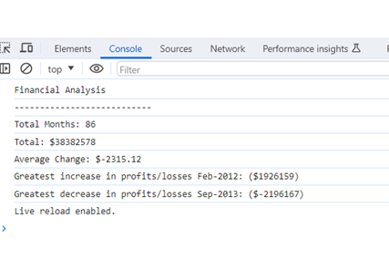

# Console-Finances

Week 4 challenge
A JavaScript program that calculates the finaces of a given Array and displays it's data in the Console.

|Summary:|

|Calculate overall profits or losses by summing monthly data and determining if the total is positive (profit) or negative (loss).|

|Compute the average change in profits by accumulating changes in each month (excluding the first) and calculating the average.|

|Identify the dates and amounts for the largest increase and decrease in profits by iterating through each month (excluding the first) and updating records if a change surpasses previous values. Display the dates and amounts for the largest increase and decrease.|

-To view data, open console in Dev Tools-

